# Normalizing Flows

**Note**: There are some bugs in the implementation of VAE+PF. For an updated Pytorch implementation, please check: [abdulfatir/planar-flow-pytorch](https://github.com/abdulfatir/planar-flow-pytorch).

### Accompanying documentation

1. [Normalizing Flows: Planar and Radial Flows](http://abdulfatir.com/Normalizing-Flows-Part-1/)
2. [Technical Report](https://github.com/abdulfatir/normalizing-flows/raw/master/report/report.pdf)

## Results

### Variational Inference with Normalizing Flows (Rezende and Mohamed)

The function that planar flow uses doesn't have analytic inverse which makes it unsuitable for direct likelihood estimation using the data. It can work well in VAEs though because inversion isn't required. However, for cases when the analytic target density is available, KL-divergence can be minimized explicitly (excluding constant terms). Following are the results for two complex 2D densities similar to the ones in the paper. The second column shows samples obtained using MCMC (See `notebooks/Metropolis-Hastings.ipynb`). The third and fourth columns show results using planar flows of different lengths (see `notebooks/PlanarFlow-Example1.ipynb` and `notebooks/PlanarFlow-Example2.ipynb`). During the experiments I found that minimizing KL is not always stable and doesn't always reach a good solution (especially for density 2). 

| True Density | Samples (using Metropolis-Hastings) | Samples (using Planar Flow; K = 4) | Samples (using Planar Flow; K = 16) |
:-------------------------:|:-------------------------:|:-------------------------:|:-------------------------:
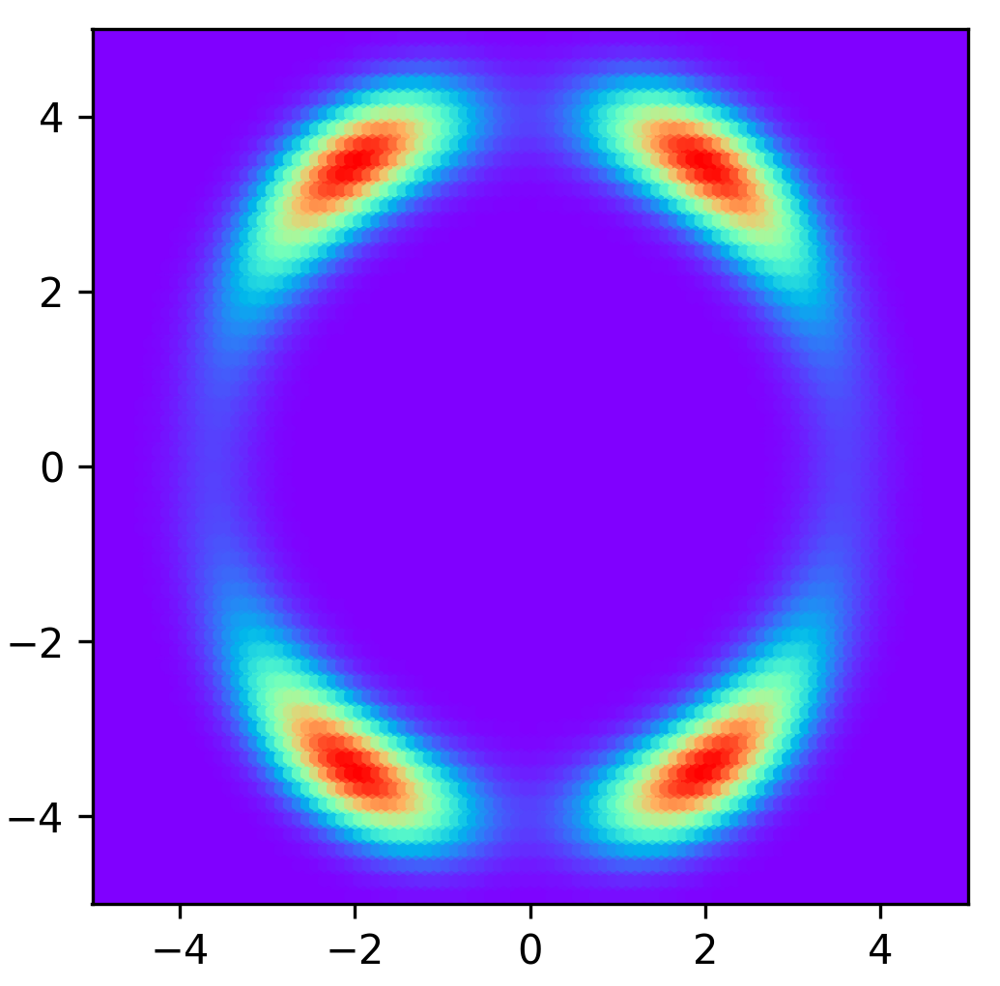 |  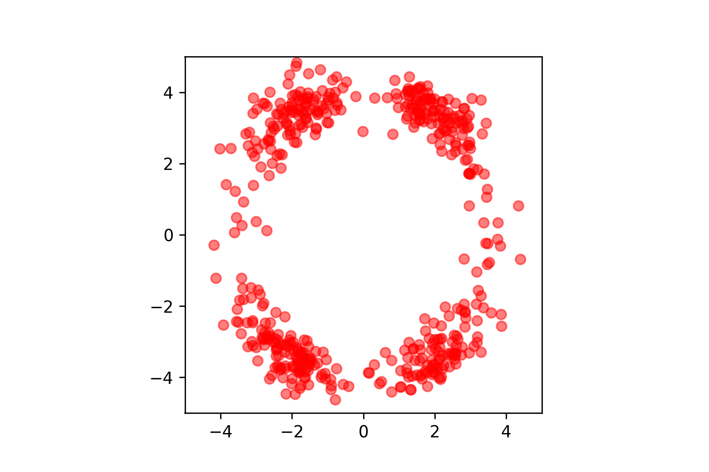 |  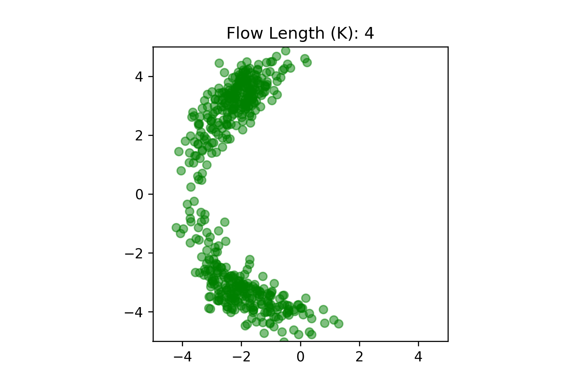 |  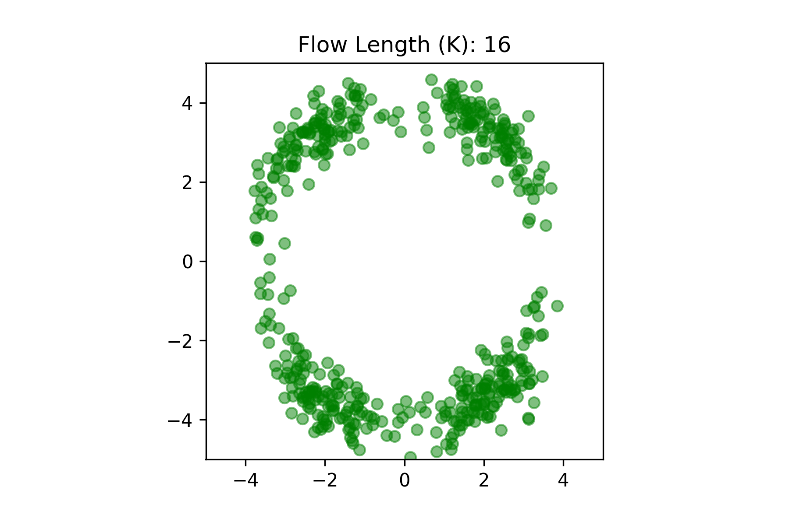
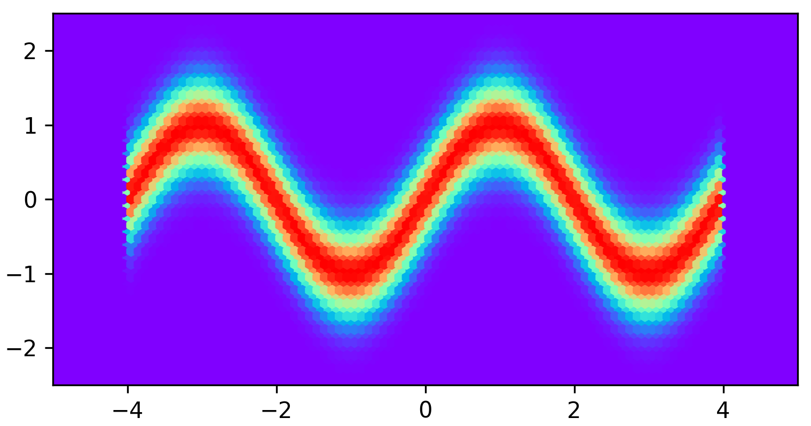 |  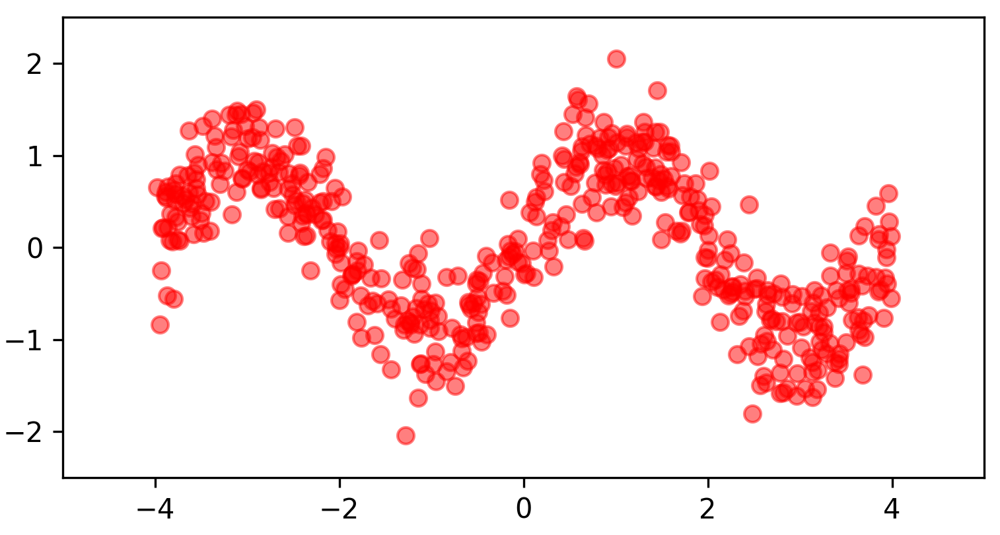 |  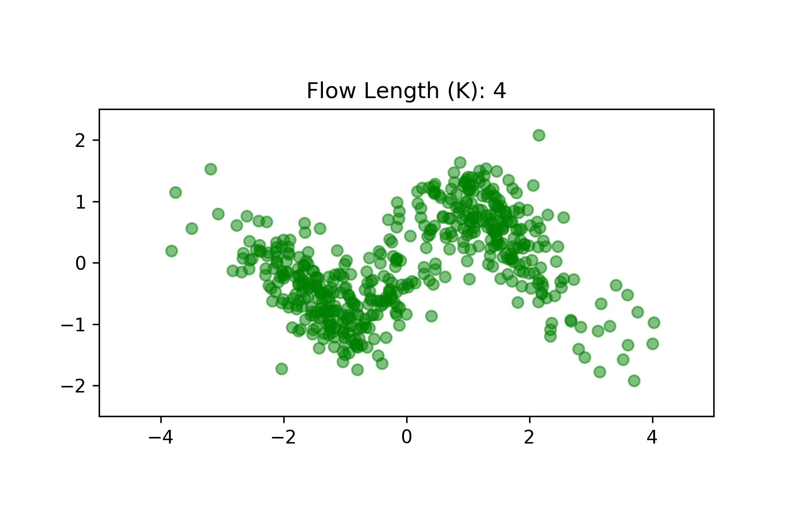 |  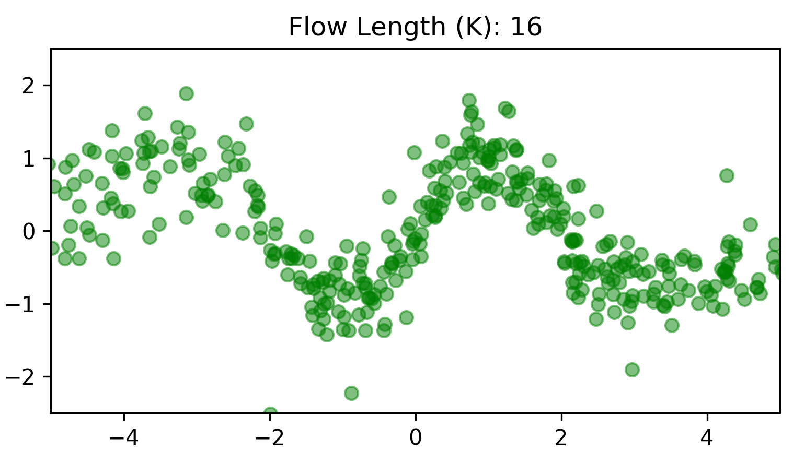
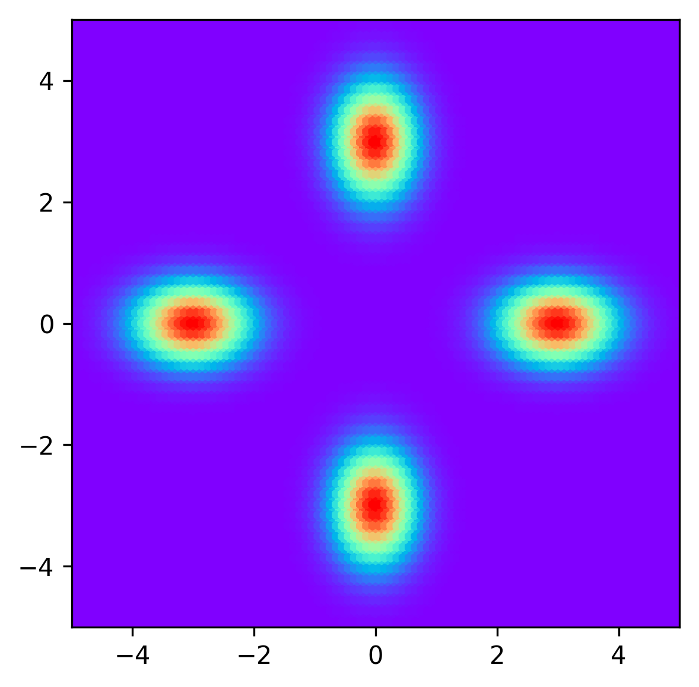 |  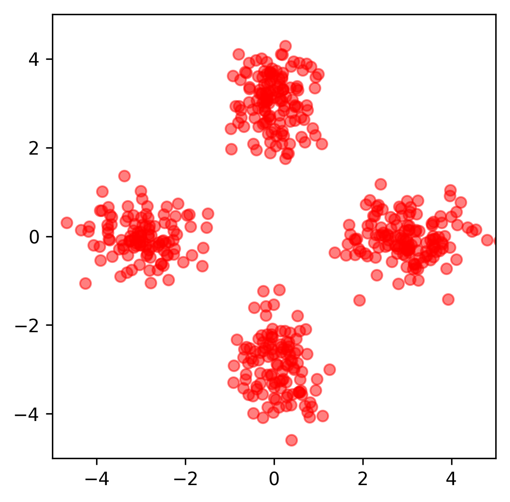 |  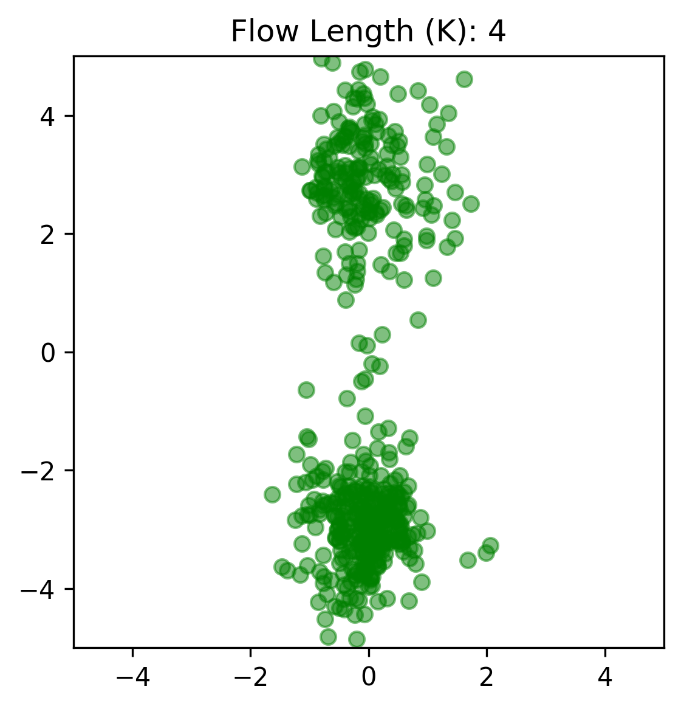 |  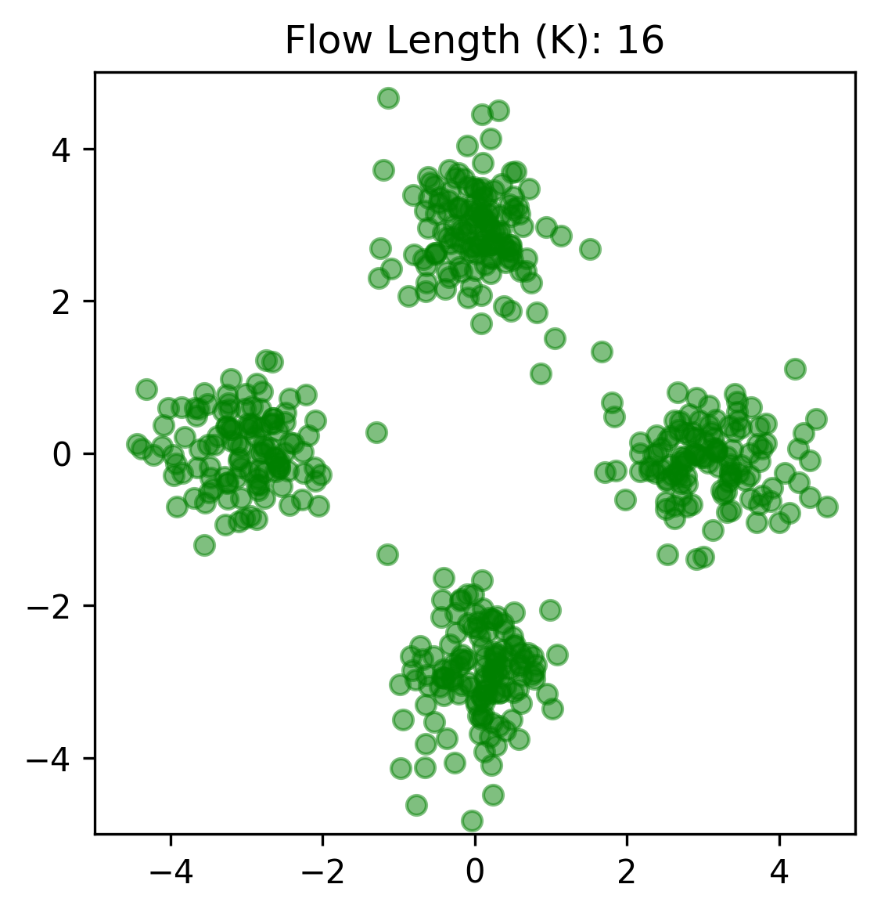

#### VAE with Planar Flow

**[REMOVED]**

There are some bugs in the implementation of VAE+PF. For an updated Pytorch implementation, please check: [abdulfatir/planar-flow-pytorch](https://github.com/abdulfatir/planar-flow-pytorch).

#### Note

Originally, this repository contained notes and code on normalizing flows which we did as a part of a course project (CS6202 @ NUS). Some ideas are borrowed from [this repo](https://github.com/ex4sperans/variational-inference-with-normalizing-flows).

